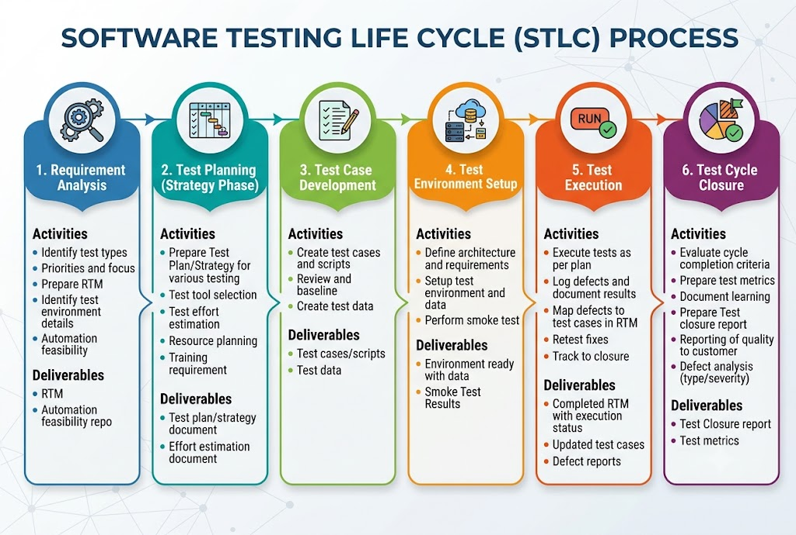
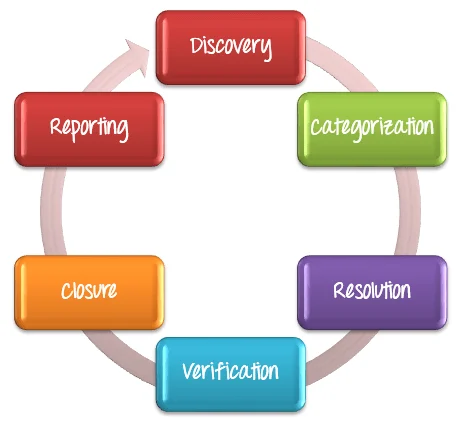

SDLF Vs STLC
---

STLC - Software Testing Life Cycle

- The Software Testing Life Cycle (STLC) is strictly **focused on testing activities**. It `does not include` the actual development phase `where developers write code`.

- Instead, writing code belongs to the broader **Software Development Life Cycle (SDLC)**.

# Requirement Analysis Phase

## Overview

- test teams study requirements from a testing perspective to identify testable components. 

- During this critical phase, QA teams interact with stakeholders, including business analysts, product managers, and developers, to understand both functional and non-functional requirements comprehensively

## Activities
* Identify types of tests to be performed.
* Gather details about testing priorities and focus.
* Prepare Requirement Traceability Matrix (RTM).
* Identify test environment details where testing is supposed to be carried out.
* Automation feasibility analysis (if required).

## Deliverables
* RTM
* Automation feasibility repo

# Test Planning Phase (Test Strategy Phase)

## Overview
This phase is also called the **Test Strategy phase**. Typically, in this stage, a **Senior QA manager** will determine effort and cost estimates for the project and would prepare and finalize the **Test Plan**.

## Activities
* Preparation of test plan/strategy document for various types of testing
* Test tool selection
* Test effort estimation
* Resource planning and determining roles and responsibilities
* Training requirement

## Deliverables
* Test plan/strategy document
* Effort estimation document

 

# Test Case Development Phase

## Overview

- It translates requirements into detailed test cases and automation scripts. Each case specifies input, expected output, and pre-/post-conditions. A strong test suite ensures coverage and minimizes missed defects—critical since the majority of software failures are due to inadequate testing.

- This phase involves creation, verification and rework of test cases and test scripts after the test plan is ready. 

- Test data, is identified/created and is reviewed and then reworked as well.

## Activities
* Create test cases, automation scripts (if applicable)
* Review and baseline test cases and scripts
* Create test data (If Test Environment is available)

## Deliverables
* Test cases/scripts
* Test data

  

# Test Environment Setup Phase

## Overview
Test environment decides the software and hardware conditions under which a work product is tested. Test environment set-up is one of the critical aspects of testing process and can be done in parallel with Test Case Development Stage. Test team may not be involved in this activity if the customer/development team provides the test environment in which case the test team is required to do a readiness check (smoke testing) of the given environment.

## Activities
* Understand the required architecture, environment set-up and prepare hardware and software requirement list for the Test Environment.
* Setup test Environment and test data
* Perform smoke test on the build

* Step 1) Identify required hardware, software, and network configurations.
* Step 2) Install operating systems, databases, and application servers.
* Step 3) Configure test data and connectivity.
* Step 4) Conduct smoke tests to verify environment readiness.

## Deliverables
* Environment ready with test data set up.
* Smoke Test Results.

  

# Test Execution Phase

## Overview
During this phase test team will carry out the testing based on test plans and test cases prepared.

## Activities
* Execute tests as per plan
* Document test results, and log defects for failed cases
* Map defects to test cases in RTM
* Retest the defect fixes
* Track the defects to closure
* Retesting fixes and performing regression checks.

## Deliverables
* Completed RTM with execution status
* Test cases updated with results
* Defect reports

  

# Test Cycle Closure Phase

## Overview
Testing team will meet, discuss and analyze testing artifacts to identify strategies that have to be implemented in future, taking lessons from the current test cycle. 

The idea is to remove the process bottlenecks for future test cycles and share best practices for any similar projects in future.

## Activities
* Evaluate cycle completion criteria based on Time, Test coverage, Cost, Software, Critical Business Objectives, Quality.
* Prepare test metrics based on the above parameters.
* Document the learning out of the project.
* Prepare Test closure report.
* Qualitative and quantitative reporting of quality of the work product to the customer.
* Test result analysis to find out the defect distribution by type and severity.

## Deliverables
* Test Closure report
* Test metrics

# STLC Entry and Exit Criteria

## Overview
Entry and Exit Criteria are essential checklists that bring discipline to each STLC phase. They act as "Quality Gates", preventing a phase from starting without the necessary inputs or concluding without verified outputs. 

They ensure readiness before progression and completion standards before moving forward within the STLC phases.

* **Entry Criteria:** Prerequisite conditions that must be satisfied before entering each STLC phase.
* **Exit Criteria:** Definite accomplishments that must be completed before closing a phase and handing off to the next.

## Phase-wise Entry and Exit Criteria

| Phase | Entry Criteria | Exit Criteria |
| :--- | :--- | :--- |
| **Requirement Analysis** | - Requirements document available - Business specifications finalized | - RTM created - Test strategy defined |
| **Test Planning** | - Requirements analysis complete - Test strategy approved | - Test plan approved - Resources allocated |
| **Test Case Development** | - Test plan approved - Requirements understood | - Test cases reviewed - Test data prepared |
| **Test Environment Setup** | - Environment requirements defined - Infrastructure available | - Environment ready - Smoke testing passed |
| **Test Execution** | - Test cases ready - Build deployed - Environment stable | - Test cases executed - Critical defects resolved |
| **Test Closure** | - Test execution complete - Exit criteria met | - Closure report signed off - Artifacts archived |

What is RTM ?
---

**RTM** stands for **Requirement Traceability Matrix** in software testing.

It is a document (usually a table) used to **map and track requirements to test cases** to ensure that every requirement is tested and no functionality is missed.

### Purpose of RTM

* Verify that all requirements are covered by test cases.
* Track the status of testing for each requirement.
* Identify missing requirements or test cases.
* Support impact analysis when requirements change.

### Sample RTM

| Requirement ID | Requirement Description | Test Case ID | Test Status |
| -------------- | ----------------------- | ------------ | ----------- |
| R001           | User Login              | TC001, TC002 | Passed      |
| R002           | Password Reset          | TC003, TC004 | Passed      |
| R003           | User Registration       | TC005, TC006 | Failed      |

### Types of Traceability

1. **Forward Traceability**

   * Maps requirements → test cases.
   * Ensures all requirements are tested.

2. **Backward (Reverse) Traceability**

   * Maps test cases → requirements.
   * Ensures no unnecessary test cases exist.

3. **Bidirectional Traceability**

   * Combines both forward and backward traceability.

### Benefits

* Ensures 100% requirement coverage.
* Helps detect missing functionalities.
* Simplifies change management.
* Improves test planning and reporting.
* Useful during audits and compliance reviews.

### Interview Answer (Short)

> RTM (Requirement Traceability Matrix) is a document that links requirements with corresponding test cases to ensure complete test coverage and traceability throughout the software testing lifecycle.

Bug Life Cycle
---

- Defect Management Process in Software Testing is a structured framework for identifying, categorizing, resolving, verifying, closing, and reporting bugs. 

- It enables predictable communication between testers and developers, improves release quality, and reduces production-level escapes across the project lifecycle.

## What is Defact Management Process ?

- It is a systematic approach used in software testing to identiy, classify, fix, verify bugs before release the software.

- The Bugs/Defact Lifecycle includes:

  1. Discovery of the defact,
  2. Categorizations - Set Sevarity and Priority and assign to the developer
  3. Resolution by developer - Fixed by developer by updating code
  4. Verifications - By tester, tester will `retesting` to ensure the defacts has been fixed properly.
  5.Clouure
  6. Defact Reporting

## Why do y0ou need defact management process ?

Without Defact Management Process, the communications between tester and developer may be toxic due to verbally or through scattered msg.

- Tester - Discover bugs, report to Test manager to developer to fix them.

- Developer - One week later, with diff understanding of that bugs or misunderstanding, report to test manager about `We fixed those defacts`.

- Test Manager - Will report to Tester about defact has been fixed by developer.

- Tester - Will retest but another 10 defacts was founds and reports to Test manager.

- So, **No Centrally management for defact**.

### 1. Discovery

- Discover most of defacts during testing by tester.

- Use Jira and Report bugs on Jira and assign to Developer.

- Once Developer will accept this bugs to fix them, its status will changed to **Accepted**.

### 2. Categorizations

- Here, Test manager will have to decide the **Sevarity** and **Priority** of that bugs, defact on Jira.

  - **Critical**
  - **High**
  - **Medium**
  - **Low**

### 3. Defact Resolutions

- Developer will schedule change management or schedule the fixes based on **Priority**, **Implement the corrections**.

- Once defact has fixed by developer, developer will report back to test manager.

**Assignment**: The defect is assigned to a developer or technician, and its status changes to Responding.

**Schedule fixing**: The development team takes over and creates a fixing schedule based on the defect priority.

**Fix the defect**: While the developers fix the defects, the Test Manager tracks progress against the planned schedule.

**Report the resolution**: Developers send a report confirming which defects have been fixed and how.

## 4. Verifications

- After developer has fixed defact, Tester will **Retesting** to ensure the defact has really fixed and there are no more bugs.

## 5. Closure

- Once a defect has been fixed and verified, its status is changed to **Closed**.

- If the defect is not properly resolved during verification, you must send a notice back to the development team to investigate it again. Closure indicates that the defect is no longer active in the system.

## 6. Defact Reporting

- **Defect Reporting** in software testing is the process by which Test Managers prepare and share defect status with the management team. 

- The management team reviews the report and provides feedback or additional support if required. Defect reporting improves communication, tracking, and visibility around defects.

Test Documentations
---

Test documentations is way to manage documatations of whole STLC every phases.

It ensures that
 
  - `What we had planned  for testing ?`

  - `What are doc created by testing team during testing like test cases, test scripts, entry/exit criteria ?`

  - `How test was executed ?` 

  - `How to test ?`

  - `What to test ?`

  - `When to test ?`

  - `What level testing will have to done ?`
  
  - `What testing types will have to done ?`

  - `Which testing strategy we have to follow ?`

## Testing Documentations LifefCycle

Testing documents are prepared across three major stages: before, during, and after testing. 

Each stage has its own set of documents with a distinct purpose.

### 1. Before Testing

Documents prepared before test execution begins help the team plan effectively, define scope, and align on requirements before a single test is excute.

### Key Documents

  - **SRS (Software Requirements Specificiations)** - Define functional and non-functional requirements of the apps.

  - **Test Policy Documents** - Its Company / Org Level Rules and Conditions to mantain quality of products. 

    - "No release can go live with critical bugs opens".

  - **Test Strategy Documents** - Describes the overall `Testing approach`, `Testing levals tools`, `Resource Planning`, `Responsibilites`.

  - **Traceability Matrix (RTM)** - Maps requirements to corresponding test cases to ensure complete test coverage and requirement traceability.

### 2. During Testing

Documents created and updated during testing help the team track `execution status`, `log defects`, and `maintain a real-time record of testing activities`.

### Key Documents
  
  - **Test Plan** - Defines testing scope, testing levels, schedules - when we have to start testing.

  - **Test Case Documents** - Documented for detailed test scenarios, test cases, test steps, expected vs actual results.

  - **Test Descriptions** - Step-by-step procedures and preconditions like **Entry criterias**, **Test Env** required to run a specific test case.

  - ** Test Case Reports** - Records of what are status of test cases, Pass, Failed, Pending for next release, How many bugs are discovered , How many bugs are fixed.

  - **Test Logs** - Exactly what happend during testing , its logs, errors, with timestamped records.

### 3. After Testing

- Once all testing has dones, It ensures the product is ready for release.

### Key Documents

  - **Test Summary Report** - It provides overall testing results including `Total executed tests`, `Passed test cases`, `Failed Test cases`, `Defacts found, fixed`