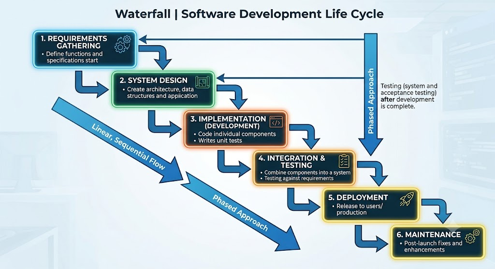
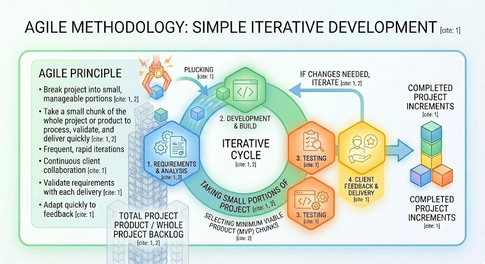

Manual Testing
----

# What is Testing QA ?

- Check software wheather it is working as aspected from given customer requirement

- Think like customer failuere and test software

- Test software before deliver to customer, so it will build your trust between client and your software.

# Types of Testing

1. Manual Testing
2. Automation Testing

3. Static Testing QA

4. Dynamic Testing QC

**Static means the code is sitting still, and Dynamic means the code is running**.

Manual: A team of engineers sits down to read through the product requirements or look over a colleague's code line-by-line to find mistakes or missing logic. This is often called a Code Review or Walkthrough.

Automation: You use tools that scan the written code for bugs, security vulnerabilities, or bad formatting without actually starting the app. In DevOps and development, these are called Linters or Static Code Analysis tools (like SonarQube).

# When we should stop testing ?.

- Its depends on 3 factors:
  1.  Delivery time to customer given by customer like 2 years
  2.  Budgets - set by customer like $80,000 for testing for 1 or 2 years
  3.  Risk - Whatever risks , bugs, faults covered during testing and its done and no bugs and risk found that you should stop testing.

- We will do **Regresssion** testing.

**Regression Testing** - We will retesting once fixed issues, bugs and we will ensure it will not repeatadly face in furture is called Regression Testing.

**Testing** - We are testing to detect bugs, issus and quick resolve it. That never ensure that this bugs will not face in future.

# Types of Horizons of testing

1. Shorter Runs

- A performance test that runs for a short period (typically a few minutes).

Purpose:

- Check immediate system behavior.
- Find quick performance issues.
- Measure response time under load.

Example:

- Duration: 5–15 minutes
- 500 users log in and browse products.

Question answered:

**Can the application handle this load for a short time ?**

2. Longer Runs

**Can the application remain stable for a long time ?**

# 7 Principle of Testing

**1. Testing shows present of defects**

- During testing we can find out some kind of bugs, defacts is there

- Testing never proves there is No Defacts

**2. Exhaustive testing is impossible**

- You can't test a product 100% correctly

- There will be a time where you have to stop testing
- There will be a budget where you have to stop testinh to do not exhast budget or do within a budget.

- You have to stop testing once you cover all defacts m and risks.

**3. Early Testing**

- Early testing means you have tested software before build or deploy it into prod which ensure you fixed all most of issues and lesser bugs in prod.

- Like Static , QA Testing.

**4. Defacts Clustering**

**cluster == Group of defacts in a single module or sigle components**

- You have 5 modules of your whole softwares.

- You found some of defacts like

  - Module A - 60
  - Module B - 50
  - Module C - 65
  - Module D - 10
  - Module E - 5

Here Module A,B,C has most of bugs, defacts founds. In Module D and E only fewer bugs.

- This is called `Defact Clustering`.

- This is happens bcz of, 
  - `Inexperienced Developers has written the code, 

  - Very complex modules
  - Modules are frequently modified

  - Poorly desinged
  - Have many integrations

**5. Pesticide Paradox**

- If you keep repeating your test cases again and again with correct data like username, passwd it will always pass, but if you did not change them or do not check for invalid passwd, username to find acutal defects, failures the test will becomes like `pesticide` which is of non use in testing.

- Always check for negative testing to see how its behave.

**6. Testing is context dependent**

**7. Absence of error falacy**

We can never have a 100% bug free apps,webs test.

Testing Steps
---

1) Tet planning and control
2) Test analysis and designs
3) Test implementations and executions
4) Evaluating exit action and reporting
5) Test closure

**1) Tet planning and control**

- Test Planning is the activity done right at the beginning of the testing project in which the test manager has resources plans, the time which is required to complete the project.

- How many resources requires for this testing project ? 2 people, 4 people ?

- How much time will required to complete this testing project ? 6 month, 1 year ?

- What is budget and how much time, resources requires with respect to budget ?

- `Test Planning is start before your project starts to peform testing`.

- `Test control` - is start after or during project start, to make sure that we are meeting the `timelines`, `we are meeting deadlines` which is decided with the client.

**2) Test analysis and designs**

**3) Test implementations and executions**

- Test cases which we had written in `2. Test analysis and designs` step that test cases we will execute to test our client requirement is meet or nots.

**4) Evaluating exit action and reporting**

- Testing can never be fininshed. Testing can be stopped.

- Once all defacts , risks has been covered and fixed and all client requirements now meets after testing, Now you can stop testing and you must have to report about your test cases and its results to your clients, manager etc.

- Now you have to generate reorts and gives to your cilents, manager

| Total no. of test cases | 350 | 
| ----------------------- | --- |
| Passed | 102 |
| failed | 248 |
| Pending / Not tested yet / Tested in next release | 100  |

**5) Test closure**

You ensure that 

  1. all test cases has writtern that must have to saved in your org server or any of secure places, 
  2. You generated reports that is saved and shared with required clients or manager.

Level of Testing
---

1. Component testing(unit testing)
2. Component integrations
3. System testing
4. System intergrations
5. UAT (User Acceptance Testing)

In both manual and automation testing, these five levels represent a progressive journey. You start by testing the smallest pieces of code and gradually combine them until you are testing the entire, fully integrated software from the end-user's perspective.

## 1. Component Testing (Unit Testing)

This level focuses on testing the smallest, lowest isolatable parts of an application—such as a single function, method, or class—in complete isolation from the rest of the system.

* **Objective:** To verify that the specific code logic works exactly as intended.
* **Manual Approach:** Rarely done manually because it requires access to the code internals. A developer might manually run a quick test script or a specific function with test inputs in their development environment, but it's highly inefficient.
* **Automation Approach:** **This is almost 100% automated.** Developers write unit tests using frameworks like JUnit (Java), PyTest (Python), or NUnit (.NET). These tests run instantly in CI/CD pipelines every time code is pushed.
* **Example:** Testing a function called `calculate_discount(price, percentage)` to ensure it returns `$90` when passed `$100` and `10%`.

## 2. Component Integration Testing

Once individual components work fine on their own, you group them together and test how they interact and share data with one another.

* **Objective:** To detect defects in the interfaces and communication between combined modules.
* **Manual Approach:** A tester might manually trigger an action that they know forces Module A to call Module B, then look at logs or the UI to see if the data passed correctly.
* **Automation Approach:** Highly automated. Developers or QA engineers write API integration tests or service-level tests using tools like Postman, RestAssured, or Python's `requests` library to verify that data flows correctly between modules without spinning up the whole UI.
* **Example:** Verifying that when the **Login Module** successfully validates a user, it passes the user's session token correctly to the **Dashboard Module**.

## 3. System Testing

At this stage, all components are integrated to form a complete, end-to-end system. Testing happens on a fully built application, usually in an environment that mimics production.

* **Objective:** To evaluate the system’s compliance with the specified functional and non-functional requirements as a whole.
* **Manual Approach:** Dedicated QA teams execute test cases from a user’s perspective. They click through the user interface (UI), try out different features, and verify business workflows (e.g., creating an account, adding an item to a cart, checking out).
* **Automation Approach:** Done using functional UI automation frameworks like Selenium, Playwright, Cypress, or Appium. Scripts mimic human actions (clicking buttons, typing text) to verify that the complete system behaves correctly.
* **Example:** Testing an e-commerce website from start to finish—searching for a product, adding it to the cart, entering shipping details, making a payment, and receiving a confirmation email.

## 4. System Integration Testing (SIT)

System Integration Testing takes the entire system you just tested and checks how it interacts with *external* systems, third-party APIs, databases, or hardware networks.

* **Objective:** To ensure your platform plays nice with outside platforms and dependency networks.
* **Manual Approach:** Testers manually execute scenarios that trigger external actions. For instance, they might make a test purchase and then log into a third-party merchant portal (like a PayPal sandbox dashboard) to verify the money arrived.
* **Automation Approach:** Automated using end-to-end integration flows. Scripts are set up to mock or directly hit external staging APIs to verify that data contracts, webhooks, and security protocols between systems are intact.
* **Example:** Verifying that your e-commerce application successfully communicates with an external **Stripe API** for payment processing and an external **FedEx API** to pull real-time shipping rates.

## 5. UAT (User Acceptance Testing)

This is the final phase of testing before the software goes live. It is performed by the client, end-users, or product owners rather than the core QA team.

* **Objective:** To validate whether the system meets the actual business needs and is ready for production deployment ("Does this solve the user's problem?").
* **Manual Approach:** **Predominantly manual.** Real users or business stakeholders beta-test the software by executing real-world business scenarios. They focus on usability, look-and-feel, and practical workflows rather than searching for technical bugs.
* **Automation Approach:** Minimal automation is used here because UAT relies heavily on human feedback and subjective user experience. However, a baseline "smoke test" suite (automated regression scripts) might be run right before handing the build over to UAT users to ensure the environment is stable.
* **Example:** A bank deploys a new loan approval app to a small group of actual loan officers. The officers use it for a week to process dummy applications and provide feedback on whether it makes their daily job easier.

### Summary Checklist

| Level | What are you testing? | Primary Owner | Manual vs. Automation |
| --- | --- | --- | --- |
| **1. Component (Unit)** | Single functions / blocks of code | Developers | **Almost entirely Automated** |
| **2. Component Integration** | Interactions between code modules | Developers / QA | **Highly Automated** |
| **3. System Testing** | The complete, end-to-end app | QA Team | **Balanced Mix** (Manual + UI Automation) |
| **4. System Integration** | App interactions with external services | QA / DevOps / Integration Team | **Highly Automated** (API & Webhook testing) |
| **5. UAT** | Business viability and user experience | End Users / Clients / Product Owners | **Almost entirely Manual** |

Software Testing Model
---

1. WaterFall Model

- We are building and testing whole product first and then we are giving to client to test it.

- Some kind of requirements doesn't match during testing stage. So we are updating whole product code, build it, test it.

- This model has been working before 10-15 years ago.

- Now `Agile Model` is working

2. Agile Model

- This doesn't create , build , test whole product.

- We are taking first small chuncks of product first like a single components of software.

- We will analyze it, read requirements, build and develop it and testing it.

- If testing are good and meeting with requirements , we will provide to and share with clients.

- Here, `Clients will perform testing and ensure all requirements are meeting`.

- If not, we will take feedback from clients, redevelop, build and test it.

## Q-1 What do you mean by Functional Testing ?

- Based on ISTQB (International Software Testing Qualifications Board): Testing designed to evaluate the functions that a component or system is intended to perform. It evaluates whether the software features behave in compliance with documented user stories, business rules, and requirements.

In Simple Terms:
- It is a verification process to ensure that all the buttons, screens, inputs, and business workflows in an application do exactly what they are supposed to do for the end user. If the requirement states "Clicking 'Submit' must save the form and send an email," functional testing checks that the form saves and the email arrives.

## How Functional Testing Lives Inside Your 5 Levels

When you perform Functional Testing, you are strictly checking if the application delivers what the user or business asked for, completely ignoring the internal code architecture or server performance.

### 1. Component Testing (Unit Testing)

* **Functional Part:** Testing an isolated function like `calculate_tax(amount)` to ensure it returns the exact expected mathematical output based on business tax laws.
* **Non-Functional Part (Not Functional Testing):** Checking how much memory that function consumes or how many milliseconds it takes to execute.

### 2. Component Integration Testing

* **Functional Part:** Verifying that the **Login Component** correctly passes a valid user's permissions profile to the **Dashboard Component** so the user can see their authorized features.
* **Non-Functional Part (Not Functional Testing):** Checking if the connection between these modules remains secure against SQL injection or data leaks.

### 3. System Testing

* **Functional Part:** Testing the entire, fully built application from the user interface. For example, registering a new user account, adding items to a cart, and verifying that the order is successfully placed in the system.
* **Non-Functional Part (Not Functional Testing):** **Performance, Load, and Stress Testing.** Testing if the system crashes when 5,000 users try to register an account at the exact same second.

### 4. System Integration Testing (SIT)

* **Functional Part:** Ensuring that when a user completes a purchase, your application successfully sends the payment data to an external API (like Stripe) and receives a "Success" token back.
* **Non-Functional Part (Not Functional Testing):** Testing network latency or what happens if the external payment gateway experiences a 10-second timeout delay.

### 5. UAT (User Acceptance Testing)

* **Functional Part:** **This level is almost 100% Functional Testing.** The actual clients or end-users interact with the software to ensure the business workflows match their day-to-day real-world operations perfectly.

> **Final Conclusion:** Functional Testing does not *equal* the 5 levels. Functional Testing is simply a **method of validation** that you use as a tool while working your way up through those 5 levels.

