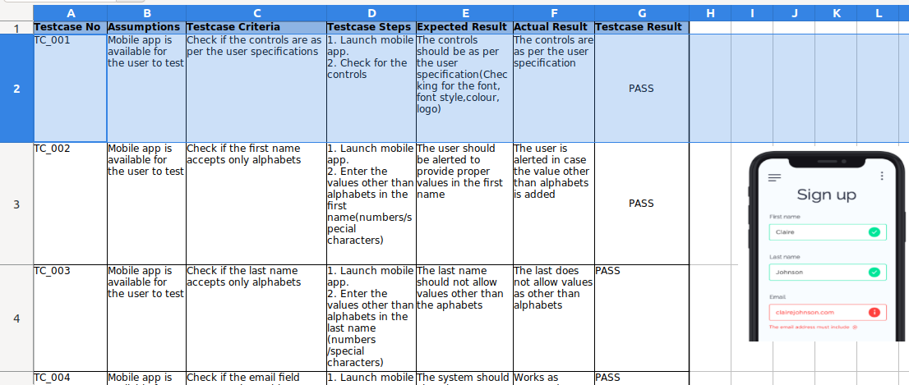
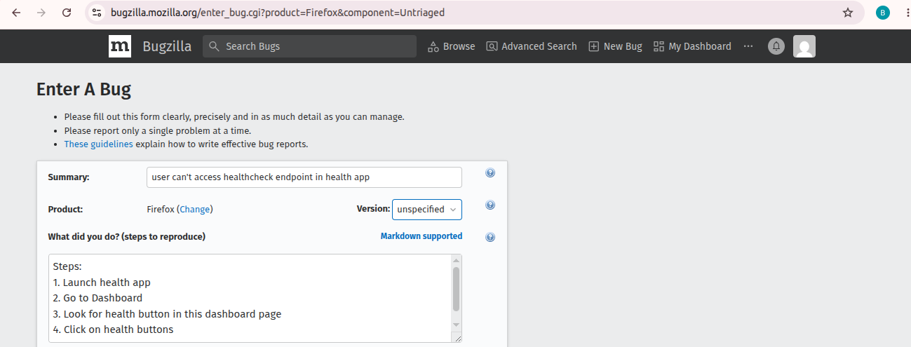
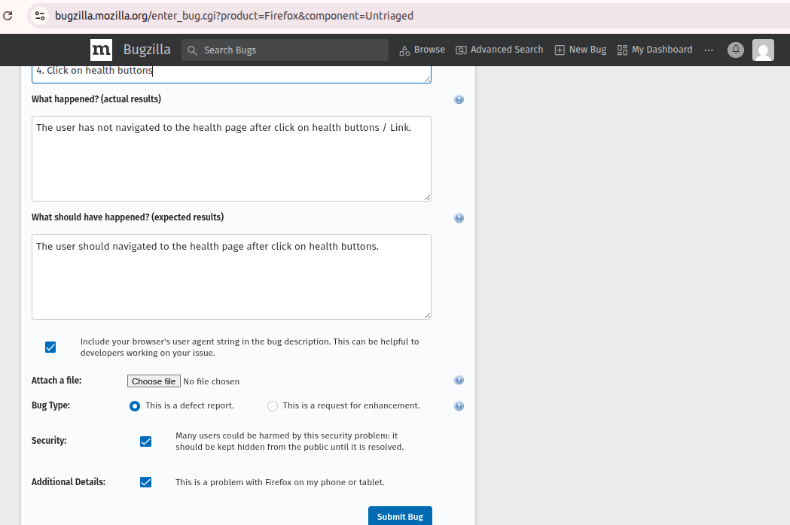
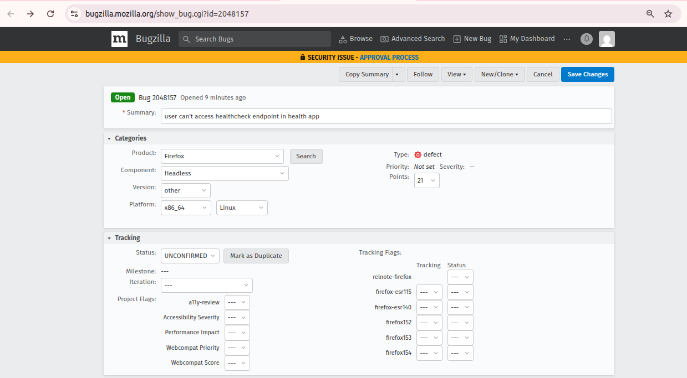
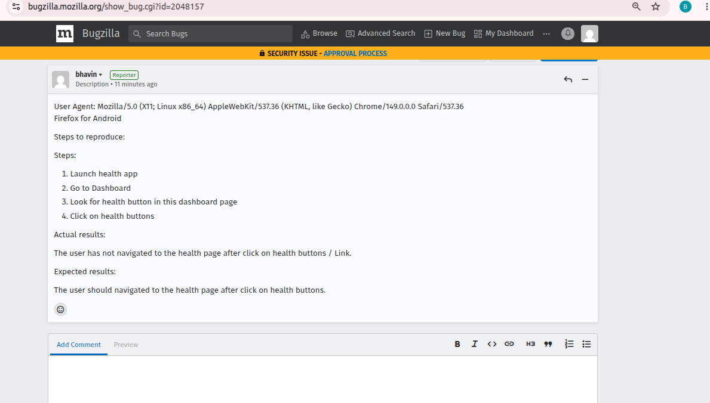

Types of Testing
---

**1. Black Box Testing**

- You have to testing for frontend , backend components

- Whatever code has written behind this components that you dont have to look and that is not of your business.

- You just have to testing over this components and generate reports.

**2. White Box Testing**

- You have to make sense that how frontend , backend and all components coding working

- You have to test with concept of this code and generate reports.

**3. Regression Testing**

- Make ensure currently fixed bugs shouldn't face in future. How ?

If you have modules like Module A, Module B like frontend, backend

- While you fixed bugs of Module A and clinet meets requiremetns. Now you will starts testing for Module B as `Agile Model`.

- **When you test the previously delivered module, again, that is called as a regression testing**.

**4. Retesting**

- When you find bugs during testing , you will report to developer.
- Developer will fix issus by debugging and update module or code.
- You will re test that module or compoenets once developer has fixed.

- You will **Not Test Previous dependent all Modules** here.

- So, This is `Retesting`.

**5. Functional Testing**

- I have Taxi Booking applications.

- I will check for its functionality like  `wheather i am able to book taxi or not ?`

- `If i'm not able to book taxi, wheather applications raise a customer support ticket or not ?`


**6. Non-Functional Testing**

- I will check application for load , volume , stress.

- How much load, stress can handle by applications.

- Wheather application is standaloen during high traffic peak ?

- Wheather application crashing or able to process all trafficd and 0 downtime , high latency or low latency ?

- By performing load testing - Increase load like send multiple request like 80k to the applications.

**Load Testing**: Tests the application under the expected number of users (e.g., 10,000 concurrent users).

**Stress Testing**: Pushes the application beyond its expected capacity to identify its breaking point (e.g., 100,000 concurrent users).

**Volume Testing**: Tests the application with very large amounts of data (e.g., millions of records), regardless of the number of users.

**7. Security Testing**

- A security tester will look for how your applications is being secure.

- How your application may be compromise ?

- How your users credetials is storing into secure place or breaching credentials ?

**8. Usability Testing**

- **Checking whether an application is easy to use, easy to understand, and user-friendly for the end user**.

- The goal is not to find functional bugs. The goal is to verify that users can perform their tasks easily without confusion, frustration, or unnecessary steps.

**Functional Testing Question**

- Can the user transfer money successfully?

- Is the amount deducted correctly?

- Is the transaction recorded?

**Usability Testing Question**

- Is the "Transfer Money" button easy to find?

- Are the instructions clear?

- Can a new user complete the transfer without help?

- Is the screen cluttered with too many options?

**9. Smoke Testing**

- Once you tested all functionality, all components and its working well.

- Then you will not recheck , retest again for all of this before deliver to the customer

- You will ensure all functionality test results are healthy before deliver to the customer

- Just like we look into checksheet for all requirements with expected output and actual output after testing.

**10. Alpha Testing**

- Alpha Testing will always done from `Developer side` only.

- Once you tested whole applications components, functionality and before deliver to the customer

- You will call to developer which is working outside to your org.

- This external developer will test your builded and tested applications from their side.

- Bcz, This external developer have diff kind of experience level and understanding of testing.

- They may able to find out bugs, issues which has not found by our org testing team yet.

- Which will lead to prevent from reoccuring in the future by - pre-fixed it.

- 1 External developer may say, Your products can do this or this much functionality working well but if your add this feature it will become user-friendly and may become popular.

**11. Beta Testing**

- Beta testing is the type of testing which is done at the client offices or basically to the end users place.

- any feedback or any inputs they have is passed on to the company which has developed that particular product.

**12. Compliance Testing**

- If you will see there are lot of products which need security compliance.

- There are lot of products which really need to comply to some rules.

- So when you are actually testing such products, you need to make sure that they are following those

- `Compliance testing is the type of testing which is done on the products to make sure that the product complied to the specific rules and regulations`.

**13. Stress Testing**


Stress Testing: Pushes the application beyond its expected capacity to identify its breaking point (e.g., 100,000 concurrent users).

**14. Volume Testing**
Volume Testing: Tests the application with very large amounts of data (e.g., millions of records), regardless of the number of users.

**15. Install Testing**

- Install application in the end user side and testing the applications.
- Installed successfully or not?

**16. UnInstall Testing**

- Uninstall applications.

**17. GUI Testing**

- Is done many times for your mobile app, web.

- UI is meet to as per clinet requirement or not ?

**18. Browser Compatibility Testing**

**19. Ad-Hoc Testing**

- Ad-hoc testing is informal testing without predefined test cases.

- Tester explores the application using experience and intuition.

- Same as Exploratory Testing


**20. Recovery Testing**

Recovery testing checks whether the application can **recover correctly after a failure**.

- Power failure

- Server crash

- Network failure

- Database crash

- System restart

**21. Backend Testing**

- Frontend and Backend

- We will not testing frontend to test backend. like we will not generate load, access web page to retrive data from database backend.

- We will directly test backend by executing query.

- If query success - test pass, If query failed - test failed.

**22. Exploratory Testing**

- Exploratory Testing is a software testing approach where the tester simultaneously:

* Learns the application
* Designs test scenarios
* Executes tests

without relying heavily on predefined test cases.

The tester actively explores the application like a real user to discover defects that may not be found through scripted testing.


## Simple Definition

> Exploratory Testing is "learning, test design, and test execution happening at the same time."


## Real-Life Example

Imagine you purchase a new smartphone.

Instead of reading the manual, you:

* Open different applications
* Change settings
* Connect to Wi-Fi
* Rotate the screen
* Install apps
* Press various buttons

While exploring, you may discover crashes, freezes, or unexpected behavior.

This is similar to Exploratory Testing.


# Traditional Testing vs Exploratory Testing

| Traditional Testing           | Exploratory Testing                       |
| ----------------------------- | ----------------------------------------- |
| Follows predefined test cases | No detailed test cases required           |
| Structured approach           | Flexible approach                         |
| Tests known scenarios         | Discovers unknown scenarios               |
| Focuses on validation         | Focuses on investigation                  |
| Less creativity required      | Requires creativity and critical thinking |


## Example: Login Functionality

### Scripted Testing

Test Case:

1. Enter valid username
2. Enter valid password
3. Click Login

Expected Result:

* User logs in successfully


### Exploratory Testing

Tester may try:

* Empty username
* Empty password
* Special characters
* Very long input values
* Refresh browser during login
* Multiple login clicks
* Multiple browser tabs

Goal:

* Discover unexpected defects


# Why Exploratory Testing is Important

Many bugs are not covered by documented test cases.

Example:

A user clicks the "Submit Order" button 10 times quickly.

Result:

* 10 duplicate orders are created.

Such issues are often discovered through exploratory testing.


# Key Characteristics

### Simultaneous Activities

The tester:

* Learns
* Thinks
* Tests

at the same time.

### User Perspective

The tester behaves like an actual end user.


### Flexible Testing

No strict dependency on written test cases.


### Creative Approach

The tester uses experience and curiosity to uncover defects.


# Skills Required for Exploratory Testing

## Curiosity

Ask:

> "What happens if I try this?"


## Analytical Thinking

Ask:

> "What can potentially fail here?"


## User Mindset

Think like an end user.


## Domain Knowledge

Understanding the business domain helps identify hidden defects.


# Common Areas to Explore

## Input Fields

Test:

* Blank values
* Special characters
* Invalid formats
* Long inputs


## Buttons

Test:

* Double click
* Rapid clicking
* Click during loading


## Navigation

Test:

* Browser back button
* Browser refresh
* Multiple tabs


## File Upload Features

Test:

* Large files
* Unsupported formats
* Corrupted files


## User Sessions

Test:

* Session timeout
* Multiple logins
* Logout behavior


# Advantages

- Finds hidden defects

- Mimics real user behavior

- Encourages critical thinking

- Useful when documentation is incomplete

- Detects issues missed by scripted testing


# Limitations

- Difficult to measure test coverage

- Depends heavily on tester skill

- Hard to reproduce if notes are not maintained

- Not suitable as the only testing approach

---

# Real Defect Example

Scenario:

1. Add product to cart
2. Open another browser tab
3. Remove product in first tab
4. Complete checkout in second tab

Expected Result:

* Checkout should fail or refresh cart

Actual Result:

* Order is placed for removed product

This is a defect commonly discovered during exploratory testing.


### Q1. What is Exploratory Testing?

**Answer:**

Exploratory Testing is a testing approach where testers learn the application, design test scenarios, and execute tests simultaneously without relying heavily on predefined test cases.


### Q2. Is Exploratory Testing Functional or Non-Functional Testing?

**Answer:**

It is a testing approach rather than a specific testing type. It can be used for both functional and non-functional testing activities.


### Q3. Can Exploratory Testing be performed without test cases?

**Answer:**

Yes. Exploratory Testing is often performed without predefined test cases and relies on tester experience, creativity, and investigation skills.


### Q4. What is the main objective of Exploratory Testing?

**Answer:**

To discover defects, risks, and unexpected behaviors that may not be identified through scripted testing.


# Quick Revision

| Question                     | Answer                                                             |
| ---------------------------- | ------------------------------------------------------------------ |
| What is Exploratory Testing? | Testing by exploring the application without predefined test cases |
| Main Goal?                   | Find hidden defects                                                |
| Who performs it?             | Testers using experience and creativity                            |
| Test Cases Required?         | No                                                                 |
| Biggest Advantage?           | Finds defects missed by scripted testing                           |
| Biggest Challenge?           | Coverage is difficult to measure                                   |

How to write Test Cases
---

Mobile Applications

| Testcase No | Assumptions | Testcase Criteria | Testcase Steps | Expected Results | Actual Results | Testcase Results |
| ----------- | ----------- | ----------------- | -------------- | ---------------- | -------------- | ---------------- |
| TC_001 | <Write your possibility to test> | <On which criteria you will test> | <Write your steps>  | <what should be results> | <what is actual results> | <Pass/Fail> |
| TC_001 | Mobile app is avaiable for the user to test | Check if the controls are as peruser spec / requirements | 1. Launch mobile app.     2. Check for the controls | The controls should be as per the user specification(Checking for the font, font style,colour, logo) | The controls are as per the user specification | Pass |



BugZilla
---

If `Expected Result` and `Actual Result` output are same , its `Pass`.

If `Expected Result` and `Actual Result` doesn't match its `Fail`. `Fail` == `Bug`.

- `Bug`, `Defact`, `Fail` are Same Things

- Once you find the `Bug` you have to raise and log the `Bug`.

- For that we will requires some software where we can log the Bug.

- Whenever you log the bug you will requires:
  
  1. Title the Bug - Name of bug
  2. Reporter - The name of reporter , who find out bug ?
  3. Priority of the Bug - Low, Medium, High
  4. Sevarity of Bug - 
  
    - `ShowStopper or Bocker` - Which we can't test of this bug. Like, you tested web url - you found 404 Error - which can't be test by tester. Will be done by Developer.

    - `Critical bug` - Some components/functionality not works, Apps slow downs.

    - `High Bug` - Low critical.

    - `Low/Enhancement`

  5. `Assigned to` - Who is actual working on it.

  6. `Date & Time` - While reported bug.

**BugZilla**

- It will helps you to generate `Bug Reports`.

- Like, `800 Bugs` has reported, `X no. of bugs has been resolved`, `Y no. of bugs has moved to released`, `Z no. of bugs are Pending`.

- You can manage bugs and Diff Project on this `BugZilla`.

- This is just like `Jira Tool` where we manage diff tickets, projects and we can track all ticket status.

- Create BugZilla account.

- Create bugs

- Give Bugs Title.

- Write steps for what did you performed ?



- What is actual results and expected results

- Choose sevarity.




- Raise bugs

- Set Priority P1 and choose higher number == Higher Priority

- Set sevarity

- Choose on which platform this bugs found on linux, windows ?



- Add Assign to and put comment on this bugs

- 

WireFrame TestCase
---

- Wireframe Testing means reviewing and validating the wireframe (UI design blueprint) before actual development starts.

- A wireframe is a simple visual layout of a webpage, mobile app screen, or software screen showing:

  - Buttons
  - Text fields
  - Menus
  - Navigation flow
  - Page structure

- without colors, images, or actual functionality.

- Check all possibilities as we earlier did.

- **Test Case** - Individula rows in the test cases files

- **Test Script** - Whole page of test case files / Combine all Rows of test cases.

Static Reviews Techniques
---

Static Testing Vs Dynamic Testing

| Static Testing (QA) | Dynamic Testnig (QC) |
| ------------------- | -------------------- |
|  when you follow the requirement documentation from the clients and based on those requirement documents, you write down the test cases | <    > |
| Static testing is done before product make ready but you are still started testing | < Deployment team has already given you the running/deployed product. It could be web, mobile apps   > |
| You took the requirements docs, you understood wat the client needs and based on those requirements docs, you already started writing the test cases. | - You are **Running the Code**. - Running Code menas, you are actually hitting the apps, webs, features, buttons and tesing how its working as per given requirements of cilents docs |
| We are acutally finding the Root Cause of failures. Why its failed ? | <   > |
| This is Early Testing. Testing before product not ready or product is in developing stage | This is Late Testing. Bcz, Testing done after produce is build |
| This testing is cheapest. Bcz, we can fix issues before product being builded by analyzing code | This is Costly testing. Bcz, We have to fix issues if we found issues after product being builded and running in prod |


Static Testing / Reviews
---

There are mainly two types of techniques used in Static Testing:


1. Informal Review
2. WalkThrough Review
3. Technical Review
4. Inspections

############


**The 4 review types** go from least to most formal. Think of formality as a dial:

The informal review is just two people talking — no meeting, no paperwork. 

The walkthrough is a step up: you book a meeting, present your work to a group (BA, dev, peer testers), and collect inputs. 

The technical review brings in an outside expert (like a DBA), requires advance preparation from both sides, and produces a documented report. 

The inspection is the most rigorous — mandatory checklist, entry/exit criteria, defined roles (author, moderator, scribe, reviewer), and sometimes involves senior leadership.


#################

# Static Testing Reviews — Complete Guide

> **Module:** Software Testing — Static Techniques  
> **Audience:** Beginners entering the software testing field  
> **Also relevant for:** ISTQB / CTFL certification preparation (this topic typically generates 8–9 exam questions)

---

## What is Static Testing?

Before diving into the four review types, it's important to understand **what static testing is** and why it matters.

Testing is done from two perspectives:

| Perspective | Also Called | When It Happens | Code Executed? |
|---|---|---|---|
| **Static Testing** | QA (Quality Assurance) | Before the product is built | ❌ No |
| **Dynamic Testing** | QC (Quality Control) | After the product is built | ✅ Yes |

In **static testing**, you review documents (requirements, test cases, design specs) while the product is still being built. You are not clicking buttons or running the application — you are *reading, reviewing, and discussing*.

In **dynamic testing**, you actually run the code — you click buttons, fill forms, and observe what happens.

### Why Static Testing Matters

Static testing finds the **cause** of failures early. Dynamic testing finds the failures themselves — but by that point, fixing them is far more expensive.

> **Real-world example:** You write 112 test cases based on requirements. Without a review, you might misunderstand requirement 1.1 and 1.2 — and test the wrong things entirely. You'd ship a faulty product, waste development time, waste testing time, and damage your organization's reputation. A static review catches this before a single line of code is written.

**Cost of fixing a bug:**
- Found during static review → **Cheap** (no code to rewrite, no retest cycles)
- Found after product is built → **Expensive** (dev time + retest time + possible deployment rollback)

---

## The New Name: Reviews

Static testing in any real organization is called **reviews**. Every organization follows some form of review process. As a tester, you will personally participate in all four types described below.

There are **four types of reviews**, arranged from least formal to most formal:

```
Least Formal                                          Most Formal
     │                                                      │
     ▼                                                      ▼
Informal Review → Walkthrough → Technical Review → Inspection
```

As you move from left to right, the process becomes more structured, more documented, more prepared, and more consequential.

---

## Review Type 1 — Informal Review

### Overview

An informal review is the simplest and most casual type of review. There is **no formalized process**, no meeting booking required, and no mandatory documentation. It happens organically between two people.

### Key Characteristics

| Property | Detail |
|---|---|
| Formality level | Least formal |
| Meeting required? | No |
| Documentation required? | No (optional) |
| Cost | Very cheap |
| Also known as | Pair programming / Tech lead reviewing work |

### How It Works

You have a problem, a question, or something you want a second pair of eyes on. You turn to a colleague and ask them to look at your work informally. They give you verbal feedback. You implement it — no paperwork, no trail, no ceremony.

### Practical Examples

**Example 1 — Tester asking a peer:**
> You've just written your test cases for a new login feature. You walk over to your colleague and say, *"Hey, can you quickly check if I've missed anything?"* They glance through and say, *"You haven't covered the case where the password is blank."* You add that test case and move on.

**Example 2 — Developer asking a peer:**
> A developer has written a function and is stuck on a logic error. They ask the developer sitting next to them to look at the code for a few minutes. The peer spots the issue and suggests a fix. No meeting, no report — just collaboration.

### When to Use It

- When you need a quick sanity check
- When the issue is minor and doesn't warrant a formal meeting
- When you're working in a small, co-located team
- When the work item is low-risk

### Limitations

- No audit trail — there's no record of what was reviewed or what was suggested
- Relies on the availability and willingness of a colleague
- Not suitable for high-stakes deliverables


## Review Type 2 — Walkthrough

### Overview

A walkthrough is a step up in formality. The **author of the work presents it** to a small group of people — peers, business analysts, developers — and collects their feedback. It is more structured than an informal review but more relaxed than a technical review or inspection.

### Key Characteristics

| Property | Detail |
|---|---|
| Formality level | Low |
| Meeting required? | Yes — a meeting room and time slot should be booked |
| Documentation required? | Optional — inputs can be documented or directly implemented |
| Who leads it? | The author |
| Main benefit | Others learn what you've done; you catch defects and misunderstandings early |

### Roles in a Walkthrough

| Role | Responsibility |
|---|---|
| **Author** | The person who created the work (test cases, code, design). Presents the material and leads the discussion. |
| **Scribe** | Takes notes on the feedback and issues raised during the session. |
| **Reviewer(s)** | Attendees who review the material and provide feedback. Can include BAs, developers, peer testers, or managers. |

### How It Works

1. The author prepares the material (e.g., test cases, a design document, a piece of code).
2. A meeting is scheduled and relevant stakeholders are invited.
3. The author walks everyone through the material — explaining what was done and why.
4. Reviewers ask questions and raise concerns or missing items.
5. The scribe notes down the feedback.
6. The author either implements the changes directly or documents them for later action.

### Practical Example

> You've written 112 test cases for a new feature. You book a 1-hour meeting and invite the Business Analyst (BA), a developer, and two peer testers. You walk them through your test cases one by one. Midway through, the BA points out: *"Your test cases for requirement 1.1 assume the user is always logged in, but the requirement says the feature must also work for guest users."* A second reviewer adds that requirement 1.2 was updated last week and your cases haven't reflected that change.
>
> You've now caught two significant gaps — **before any development started** — saving potentially weeks of rework later.

### Benefits

- **For the audience:** They gain understanding of the work, which helps in later testing and development phases.
- **For the author:** Defects and misunderstandings are found and fixed early.
- **For the project:** Fewer bugs survive to later stages, reducing cost and risk.

### When to Use It

- After writing a significant batch of test cases
- After completing a design document
- After writing code for a non-trivial feature
- When you want structured feedback from multiple perspectives

## Review Type 3 — Technical Review

### Overview

- You are testing and you are facing some techincal issues like sql queries code, you need some guidence in database point of view.

- You worked for same issue for couple of hr, days and you are not able to solve it. Even you asked to your peers , your team like informal and walktrhough. You will requires techincal expert outside of your team Mr.Tom.

- Before reaching to Mr.Tom. You must have to prepaired from yourself for what's queries you want to ask. Make documentations. Send this docs to Mr.Tom so he will well prepaired during meeting. Schedule Meeting with Mr.Tom and your Team. Also Notedown the steps and remedies suggested by Mr.Tom and documented it.

A technical review is a **formal, structured session** where a **domain expert** (someone with deep knowledge in a specific area) is brought in to review the work. It goes beyond peer feedback — the goal is to solve technical problems and detect defects with the help of expert knowledge.

### Key Characteristics

| Property | Detail |
|---|---|
| Formality level | Medium-high |
| Meeting required? | Yes — with advance scheduling |
| Pre-meeting preparation | Mandatory — both author and expert must prepare beforehand |
| Documentation required? | Yes — a review report is created |
| Management attendance | Optional |
| Main purpose | Solve technical difficulties and detect defects |

### The Key Difference from Walkthrough

In a walkthrough, you present your work to familiar teammates. In a technical review, you bring in an **expert from outside your immediate team** who has specialized knowledge you lack. Crucially, you **send the expert the relevant material in advance** so they are prepared when they arrive — you do not spring the problem on them cold.

### How It Works

1. The team identifies a technical problem they cannot resolve internally.
2. An expert is identified — someone with deep knowledge in the relevant domain.
3. The author sends the expert all relevant material **before the review session** (problem description, code, documentation, queries, etc.).
4. A meeting is scheduled. The author and team also prepare their specific questions and issues in advance.
5. The expert reviews the material, then sits with the team for a focused session.
6. Issues are identified and solutions are proposed.
7. A **review report** is created documenting the issues found and the recommended fixes.
8. The team implements the changes.

### Practical Example

> Your team has been struggling with complex SQL queries for two days. The queries run incorrectly and no one on the team has the database expertise to diagnose the issue. You know that **Mr. Tom** in another team is an experienced Database Administrator (DBA).
>
> Rather than wasting more time, you send Mr. Tom an email explaining the problem, attaching the queries, and asking him to review before a meeting scheduled for the next day. Mr. Tom comes prepared. In the session, he identifies the issue within 20 minutes — an incorrect JOIN type and a missing index. You document his recommendations in a review report and fix the queries accordingly.

### When to Use It

- When your team is blocked by a specialized technical problem
- When you need an expert to validate a technical approach or design decision
- When the risk of getting something wrong is high (e.g., security, performance, data integrity)
- When an architecture or infrastructure decision needs expert validation

### Review Report Contents (Typical)

- Date and participants
- Work item reviewed (e.g., which queries, which modules)
- Issues found (listed)
- Recommended actions or fixes
- Owner and deadline for each action item

## Review Type 4 — Inspection

### Overview

Inspection is the **most formal review** in software testing. It follows a strictly defined process with mandatory `checklists`, `defined entry` and `exit criteria`, clearly `assigned roles`, and mandatory preparation for all participants. It may involve senior leadership, including CXOs.

### Key Characteristics

| Property | Detail |
|---|---|
| Formality level | Highest |
| Meeting required? | Yes — highly structured |
| Checklist required? | Mandatory |
| Entry/exit criteria? | Defined — clear conditions for starting and ending the review |
| Pre-meeting preparation? | Mandatory for all participants |
| Management attendance? | Possible — CXOs may attend |
| Main purpose | Rigorous defect detection + formal quality verification |

### Roles in an Inspection

| Role | Responsibility | Required? |
|---|---|---|
| **Author** | Created the work item being inspected. Presents and clarifies the material. | ✅ Yes |
| **Moderator** | Facilitates the meeting, keeps it on track, ensures the process is followed, manages the checklist. | ✅ Yes |
| **Scribe** | Records all defects, issues, and decisions discussed during the session. | ✅ Yes |
| **Reviewer(s)** | Examine the material in advance and raise issues during the meeting. | ✅ Yes |
| **Reader** | Reads the material aloud during the meeting to guide the discussion. | ❌ Optional |

### How It Works

1. **Pre-meeting prep:** All participants (author, moderator, reviewers) study the material thoroughly before the session. Materials are distributed well in advance.
2. **Entry criteria checked:** Before the meeting starts, entry conditions must be met (e.g., material is complete, all reviewers have prepared). If not met, the meeting is postponed.
3. **Inspection meeting:** The moderator runs the session against a checklist. The scribe documents every issue raised. Each checklist item is evaluated.
4. **Exit criteria checked:** At the end, exit conditions must be met (e.g., all checklist items addressed, defect count below threshold). If not met, a re-inspection may be required.
5. **Defect logging:** All found defects are formally logged — nothing is passed verbally without documentation.
6. **Rework:** The author fixes the issues identified.
7. **Follow-up:** The moderator verifies that all documented issues have been resolved.

### Practical Example

> A new product specification document is ready for release. Before it can be approved, it undergoes a formal inspection. The CTO chairs the session as moderator. The author (a senior BA) presents the document. Two senior developers and a QA lead serve as reviewers — they have all read the document beforehand and prepared notes.
>
> The moderator works through a **mandatory checklist** item by item: completeness, consistency, correctness, testability, ambiguity. The scribe logs every issue raised. At the end, the exit criteria state that all "critical" defect items must be resolved before the document can be signed off. Three critical items are logged. The inspection is not closed until those three items are addressed and verified.

### When to Use It

- For critical, high-risk deliverables (system architecture docs, compliance documents, safety-critical specifications)
- When there is regulatory or contractual obligation to demonstrate formal review
- When leadership needs formal sign-off on a work item
- In large organizations with defined quality gates

---

## Comparison: All 4 Review Types at a Glance

| Property | Informal Review | Walkthrough | Technical Review | Inspection |
|---|---|---|---|---|
| **Formality** | Minimal | Low | Medium | High |
| **Meeting required** | No | Yes | Yes | Yes |
| **Preparation required** | No | Recommended | Mandatory | Mandatory |
| **Documentation** | Not required | Optional | Review report | Full formal record |
| **Checklist** | No | No | Sometimes | Mandatory |
| **Entry/exit criteria** | No | No | No | Yes |
| **Roles defined** | No | Author, Scribe, Reviewers | Author, Expert(s) | Author, Moderator, Scribe, Reviewer(s) |
| **Management involvement** | No | Rarely | Optional | Possible |
| **Best for** | Quick sanity checks | Sharing work with peers | Solving technical problems | High-stakes formal verification |
| **Cost** | Very low | Low | Medium | High |


## The Formal Review Process (Applies to Technical Review and Inspection)

Any formal review follows this 6-stage process:

```
1. Planning → 2. Kick-off → 3. Preparation → 4. Review Meeting → 5. Rework → 6. Follow-up
```

| Stage | What Happens |
|---|---|
| **1. Planning** | Book the meeting room and time slot. Confirm all required participants are available. Distribute materials in advance. |
| **2. Kick-off** | The meeting officially begins. Roles are confirmed, objectives are stated, and everyone aligns on scope. |
| **3. Preparation** | All reviewers and the author study the materials before the review meeting. If anyone is unprepared, the meeting may be postponed. |
| **4. Review Meeting** | The actual review session. Issues are identified, discussed, and logged by the scribe. The moderator keeps things on track. |
| **5. Rework** | The author incorporates the agreed changes. This step may be skipped if no significant issues were found. |
| **6. Follow-up** | Verify that all logged action items have been completed. For example, if 7 issues were raised, confirm all 7 are resolved before closing the review. |

> **Important:** Preparation (Stage 3) is a gate. If reviewers have not read the material, the review meeting (Stage 4) is not productive and should be rescheduled.


## Success Factors for Reviews

How can you say that all reviews are suyccessfully reviews and resolved as per suggested during meeting ?

### 1. Pre-preparation is done
If a review requires preparation, ensure all participants have actually done it before the meeting. An unprepared review wastes everyone's time.

### 2. Clear objectives are set
Every review must have defined goals — what specifically is being checked? Without objectives, meetings drift into unrelated discussions.

### 3. Defects are welcomed, not punished
If 8 issues are found during a review, that is a success — not a failure. Those 8 bugs will not reach the customer. A culture where people fear raising defects kills honest reviewing.

### 4. Management supports reviews
Some organizations treat reviews as "wasted time" because they don't immediately produce visible output. Without management buy-in, reviews get skipped. Leadership must understand that reviews save more time than they cost.

### 5. Checklists are used where appropriate
Checklists ensure consistency and completeness, especially in inspections. They help reviewers focus on what matters and prevent important items from being overlooked.

### 6. Appropriate techniques and tools are used
Many tools exist to support review processes — from simple document collaboration tools to dedicated review management systems. Using the right tool for the right type of review improves efficiency.