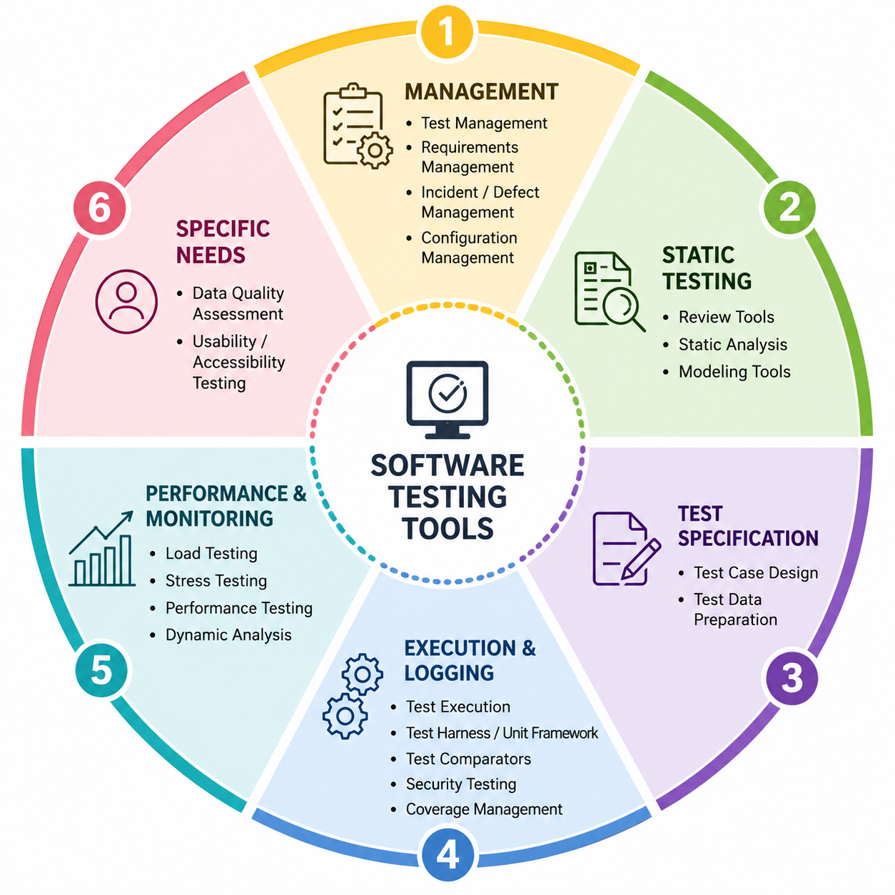

Automation Tools
---

## Why Do We Need Testing Tools?
 
Imagine you're manually testing a mobile app. You click the same buttons 100 times a day. You write down results on a spreadsheet. You email test results to your manager. You search through old test results to check if a bug happened before.
 
**That's exhausting and error-prone.**
 
Testing tools automate and organize this chaos. They let you:
- Run tests automatically (click buttons without you clicking them)
- Track what you tested and what you found
- Store test results so you can compare them later
- Organize thousands of test cases so you can find them instantly
- Find bugs before humans even have to look
Think of testing tools like the **difference between washing 100 dishes by hand vs. using a dishwasher**. Both get the job done, but one is way faster and more reliable.
 
---
 
## The 6 Types of Testing Tools
 
Testing tools are grouped into 6 families. Each family handles a different job in the testing process:
 
```
1. Management & Tracking  →  Keeps all your test cases and bugs organized
2. Static Testing         →  Finds bugs before code is even written
3. Test Design           →  Generates smart test cases automatically
4. Test Execution        →  Runs tests automatically without human clicking
5. Performance Testing    →  Checks if the app is fast enough
6. Special-Purpose Tools →  Check specific things like security or usability
```


##################



### Pillar 1: Management of Testing & Tests
These tools act as the central operational cockpit for the QA team, maintaining tracking, governance, and historical baselines.

* **Test Management Tools:** Used to write, store, organize, and track the execution history of hundreds or thousands of test cases across multiple releases.
    * *Industry Examples:* Jira (with Xray/Zephyr plugins), TestRail, ALM.
* **Requirements Management Tools:** Tracks the evolutionary changes, client specifications, and version iterations (e.g., mapping Version 1.1 with 10 requirements to Version 1.3 with 17 requirements) to ensure strict traceability.
    * *Industry Examples:* IBM DOORS, Jama Connect, Confluence.
* **Incident (Defect) Management Tools:** Captures, prioritizes, assigns, and tracks software bugs from discovery through to closure.
    * *Industry Examples:* Bugzilla, Jira Software, GitHub Issues.
* **Configuration Management Tools:** Maintains precise version control and history over code, assets, environments, and even requirement documents, mapping out exactly which engineer altered a specific module.
    * *Industry Examples:* Git (GitHub, GitLab, Bitbucket), SVN.

### Pillar 2: Static Testing Tools
Static testing occurs **before** the code is compiled or executed. These tools inspect source code, requirements, or design schemas statically to prevent defects from leaking into runtime environments.

* **Review Tools:** Assist teams in checking documents, code files, and peer contributions systematically.
* **Static Analysis Tools (Compilers/Linters):** Automatically analyze code line-by-line to point out architectural issues, syntax anomalies, and structural bugs without running the software. *Analogous to a programming compiler flagging errors on exact lines (e.g., line 410)*.
    * *Industry Examples:* SonarQube, ESLint, Checkstyle.
* **Modeling Tools:** Help create system diagrams, workflows, and logical architectural schemas to validate business logic before coding begins.
    * *Industry Examples:* Enterprise Architect, Lucidchart.

### Pillar 3: Test Specification Tools
These utilities streamline the foundational design and generation phases of software testing.

* **Test Case Design Tools:** Systems that assist in generating logically balanced, mathematically optimized test scenarios (e.g., pairwise or boundary values).
* **Test Data Preparation Tools:** Generates massive datasets on-demand based on criteria rules (e.g., auto-creating 50 million unique user records containing randomized fields for `Username`, `Password`, and `Age`), sparing weeks of manual manual entry.
    * *Industry Examples:* Mockaroo, Talend, Informatica Test Data Management.

### Pillar 4: Test Execution & Logging Tools
These functional tools handle the automated step-by-step driving of the application and the reporting of programmatic outcomes.

* **Test Execution Tools:** Directly drive the user interface or API, reading test inputs and executing actions seamlessly.
    * *Industry Examples:* Selenium, Playwright, Cypress.
* **Test Harness / Unit Frameworks:** Provide the runtime environment, drivers, stubs, and core engine configurations needed to execute isolated blocks of tests.
    * *Industry Examples:* JUnit, NUnit, PyTest.
* **Test Comparators:** Automated programmatic assertion mechanisms that compare actual baseline outputs against expected reference data.
* **Security Testing Tools:** Scan applications for vulnerabilities, misconfigurations, and exposure to malicious exploitation.
    * *Industry Examples:* OWASP ZAP, Burp Suite.
* **Coverage Management Tools:** Measure what percentage of code statements, branches, or system requirements have been touched by your test cases, ensuring no gaps remain.
    * *Industry Examples:* JaCoCo, Istanbul.

### Pillar 5: Performance & Monitoring Tools
Non-functional validation mechanisms that assess how the application behaves under workload constraints, hardware fatigue, and time.

* **Load Testing Tools:** Simulates projected, real-world multi-user workloads to measure response speed and stability.
    * *Industry Examples:* Apache JMeter, Gatling.
* **Stress Testing Tools:** Pushes systems past their operational breaking points to observe structural degradation, failure behaviors, and recovery capacity.
* **Dynamic Analysis Tools:** Monitors the application's engine in real-time execution, exposing runtime memory leaks, pointer overflows, and processing bottlenecks.
* **Monitoring Systems:** Constantly track infrastructure health (e.g., checking an ECG medical device 24/7 to catch telemetry issues over extended windows).

### Pillar 6: Specific Needs Tools
A modern classification addressing dedicated, nuanced quality assurance vectors that operate outside typical functional boundaries.

* **Data Quality Assessment Tools:** Evaluates the structural integrity, freshness, and accuracy of data within databases, filtering out data redundancies or bad formats.
* **Usability & Accessibility Testing Tools:** Automatically verifies how intuitive or inclusive an application is, with a heavy emphasis on checking support for users facing visual impairment, color blindness, or physical limitations.
    * *Industry Examples:* axe DevTools, Lighthouse.

---

## 3. Sr. QA Advice: Choosing Vendor Solutions

As emphasized in your text, professional training avoids marketing specific tool brands because the "best tool" is entirely context-dependent. When auditing tools for your project on the open market, always look at:
1. **Open Source vs. Commercial Costs** (Budget availability).
2. **Technical Skill Alignment** (Can your testers write in code required by the tool?).
**Mobile Application Testing**
3. **Application Stack Integration** (Does it interface cleanly with your software architecture?).


**Considerations things for security perspective**

- While you testing for `mobile applications like IoS, Android` you can use `Automation Tools like Appium`.

- While you testing for `Web applications` you should use `selenium + java` or any other tools. But, you can't use `Selenium` in `Mobile App Testing`. You can't use `Appium` for `Web App Testing`.

- This is the limitations of automation tools.


- While you open Banking App in website or moible apps.

- And you are not active for 1-2 minutes, for security reasons you should be auto logout.

- While you are filling a form, giving details in your web or mobile app, Immediately you receive a call, Your data should persistive and shouldn't be deleted.

- Your Applications should open as per your mobile app settings like `landscape`, `portrait` and also data should persistive.

- While you click on any of buttons which will you redirect to another new tab and new page and now you  want to come back to previous page your data and its status should persistive.

- Filling HSC or Graduations addminssions form.