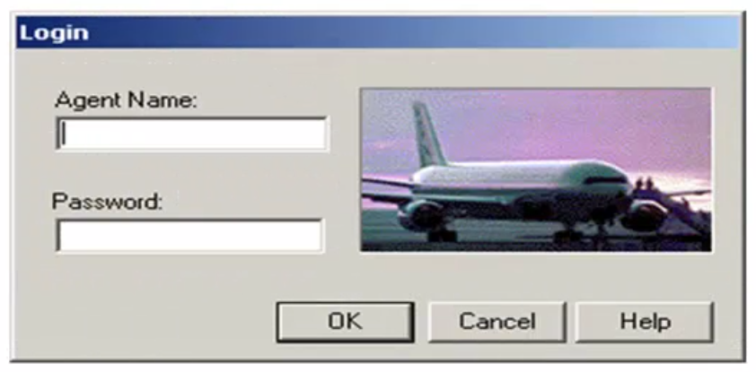
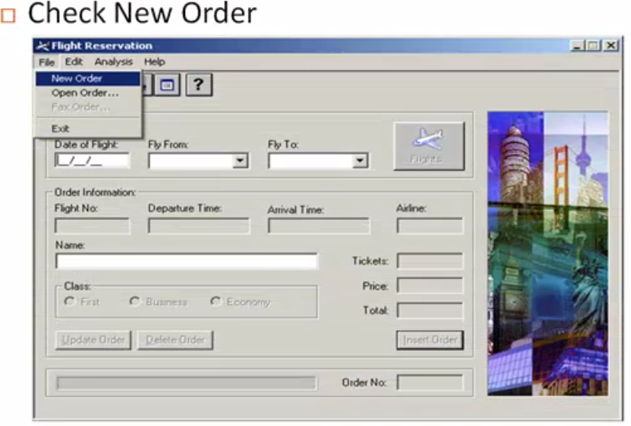
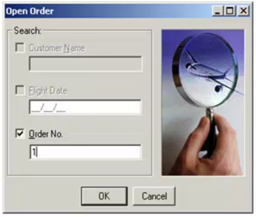
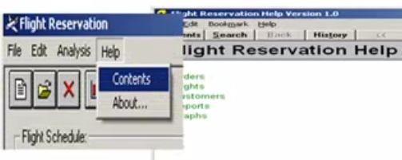

Test Scenarios
---

What you are going to test ?
How many possibiblity to test the functionality ?

This is called `test scenarios`.

- `Test Scenarios` is created from `SRS` and `User Story` Docs.

- A Test Scenarios is any functionality of the applications under test, that can be tested.

- It is also called **Test conditions** or **Test possibility**.

**Scenario 1**

  **1. Check Login Funcitionality**

  **2. Check new orders**

  **3. Check open order**

  **4. Check help sections**

## Types of Test Scenarios

Test scenarios can be classified based on what aspect of the application they aim to verify. Understanding these types ensures full coverage across all functionality and user interactions.

### 1. Functional Scenarios
*   **Focus:** Validates "what the system should do."
*   **Description:** Verifies if specific features or modules work according to the defined requirements.
*   **Examples:** Testing login, signup, or checkout flows.

### 2. Non-Functional Scenarios
*   **Focus:** Assess how the system performs rather than what it does.
*   **Description:** Evaluates the technical characteristics and operational behavior of the software.
*   **Key Areas:** Performance, scalability, usability, and reliability.

### 3. Security Scenarios
*   **Focus:** Data protection and vulnerability assessment.
*   **Description:** Evaluates how well the application protects user data and prevents unauthorized access or potential exploits.

### 4. UI (User Interface) Scenarios
*   **Focus:** Visuals and presentation.
*   **Description:** Ensures the visual layout, navigation, and interactive elements function intuitively across different devices and screen sizes.

### 5. End-to-End Scenarios
*   **Focus:** Comprehensive real-world workflows.
*   **Description:** Simulates actual user journeys to verify that multiple modules work together seamlessly.
*   **Example:** Searching for a product, adding it to the cart, and successfully completing the payment in an eCommerce application.

## How to Write Test Scenarios

Testers can follow these five core steps to create comprehensive test scenarios:

*   **Step 1:** Read the Requirement Documents such as BRS, SRS, or FRS of the System Under Test (SUT). You can also refer to use cases, manuals, or relevant books.
*   **Step 2:** For each requirement, map out possible user actions and objectives. Analyze technical requirements, look for potential scenarios of system abuse, and evaluate users with a hacker's mindset.
*   **Step 3:** After completing a thorough requirements analysis, list out the different test scenarios that verify each software feature.
*   **Step 4:** Create a [Traceability Matrix](https://www.guru99.com/traceability-matrix.html) to map your scenarios back to requirements, ensuring that every single requirement has a corresponding test scenario.
*   **Step 5:** Submit the created scenarios for a review by your supervisor, followed by evaluations from other project stakeholders.

 

## How Can AI Help in Test Scenario Automation?

AI makes test scenario automation smarter, faster, and more adaptive than traditional scripting methodologies:

*   **Auto-Generation:** Instead of manually writing scripts, AI tools can automatically generate test scenarios from user stories, technical requirements, or historical project data.
*   **Predictive Analysis:** Machine learning platforms analyze historical test failure patterns to predict high-risk areas, allowing testers to focus efforts where it matters most.
*   **Self-Healing Scripts:** AI-driven automation frameworks automatically update object locators whenever the UI changes, dramatically reducing script maintenance time.
*   **Continuous Integration:** They integrate directly into [CI/CD pipelines](https://www.guru99.com/continuous-integration.html) to provide continuous testing and instant, real-time feedback loop workflows.
*   **Journey Simulation:** For example, an AI engine can simulate thousands of unique user journeys on an eCommerce site to discover broken flows and suggest optimized test coverage.

 

## Tips to Create Test Scenarios

*   **Link to Requirements:** Each test scenario should be explicitly tied to at least one requirement or user story as dictated by your project methodology.
*   **Verify Isolation First:** Before writing complex scenarios that span multiple requirements at once, make sure you have simpler test scenarios that check each requirement in isolation.
*   **Avoid Over-Complications:** Do not create overly complicated, tangled test scenarios that attempt to span too many requirements simultaneously.
*   **Prioritize Coverage:** Because lists of scenarios can grow large and executing them all is expensive, always select and run specific test scenarios based on customer priorities and risks.
*   **Concept Reminder:** A test scenario describes *what* to test, whereas a test case outlines *how* to test it.

## Practical Examples of Test Scenarios

### Example 1: Test Scenarios for eCommerce Application

To ensure an eCommerce application functions perfectly, testers evaluate multiple critical real-world workflows. Below are the key scenarios along with their conceptual context and related distinct validation goals:

#### **Test Scenario 1:** Check the Login Functionality

To illustrate the difference between a high-level *Scenario* and specific *Test Cases*, the specific validations for this login scenario include:
1. Check system behavior when valid email ID and password are entered.
2. Check system behavior when invalid email ID and valid password are entered.
3. Check system behavior when valid email ID and invalid password are entered.
4. Check system behavior when invalid email ID and invalid password are entered.
5. Check system behavior when email ID and password are left blank and Sign In is entered.
6. Check if "Forgot your password" is working as expected.
7. Check system behavior when valid/invalid phone number and password are entered.
8. Check system behavior when “Keep me signed in” is checked.

#### **Test Scenario 2:** Check the Search Functionality

#### **Test Scenario 3:** Check the Product Description Page

#### **Test Scenario 4:** Check the Payments Functionality

#### **Test Scenario 5:** Check the Order History

**Additional Essential eCommerce Scenarios:**
*   Check Home Page behavior for returning customers.
*   Check Category/Product Listing Pages.
*   Check Customer Service/Contact Pages.
*   Check Daily Deals pages.

### Example 2: Test Scenarios for a Banking Site

Banking platforms demand highly secure and transaction-focused user verification strategies. Key high-level operational scenarios include:

*   **Test Scenario 1:** Check the Login and Authentication Functionality (Multifactor validation, session timeouts).
*   **Test Scenario 2:** Check Money Transfer can be done successfully (Internal and external account transfers, limits verification).
*   **Test Scenario 3:** Check Account Statement can be viewed and downloaded (Date filters, statement accuracy).
*   **Test Scenario 4:** Check Fixed Deposit/Recurring Deposit can be created and managed.